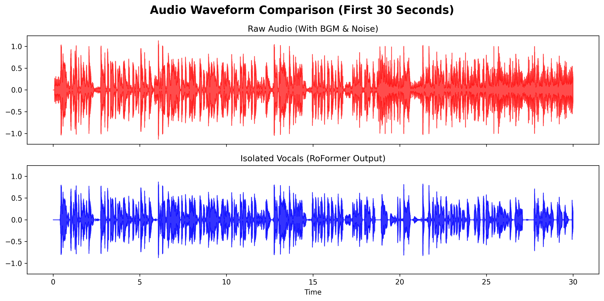

# 🎙️ Vocal-Isolated Subtitle Pipeline (RoFormer + Whisper)

An advanced, production-ready pipeline that generates highly accurate subtitles from noisy audio/video files. By isolating human vocals using the State-of-the-Art **BS-RoFormer** model before feeding the audio into **OpenAI's Whisper**, this pipeline drastically reduces Word Error Rates (WER) and eliminates AI hallucinations caused by background music and sound effects.

## 🚀 Key Features
* **BGM & Noise Removal:** Uses `audio-separator` (RoFormer) to extract pure vocal stems.
* **High-Accuracy Transcription:** Leverages `Whisper large-v3` for robust English transcription.
* **Auto-Timestamping:** Converts transcription segments directly into perfectly synced `.srt` files.
* **Memory Optimized:** Includes GPU VRAM management (garbage collection) for Kaggle/Colab environments.

## 🏗️ Architecture
`Raw Media` ➔ `RoFormer (Vocal Isolation)` ➔ `Clean Vocal Track` ➔ `Whisper Large-v3` ➔ `.SRT File`

## 🛠️ Tech Stack
* **Language:** Python
* **Machine Learning:** OpenAI Whisper, BS-RoFormer (Music Source Separation)
* **Audio Processing:** Librosa
* **Environment:** Kaggle Notebooks (T4 GPU)

## 📊 Visual Evidence
*(Jika kamu punya gambar dari langkah visualisasi, tambahkan kode ini)*

*Notice how the isolated vocal track (bottom) strips away the chaotic background noise, leaving clean speech patterns for Whisper.*

## 💻 How to Use
1. Open the `.ipynb` file in Kaggle or Google Colab (Ensure GPU is enabled).
2. Insert your Google Drive File ID containing the raw media (MP4/MP3).
3. Run all cells. The pipeline will automatically download, process, and generate a ZIP file of the subtitles.